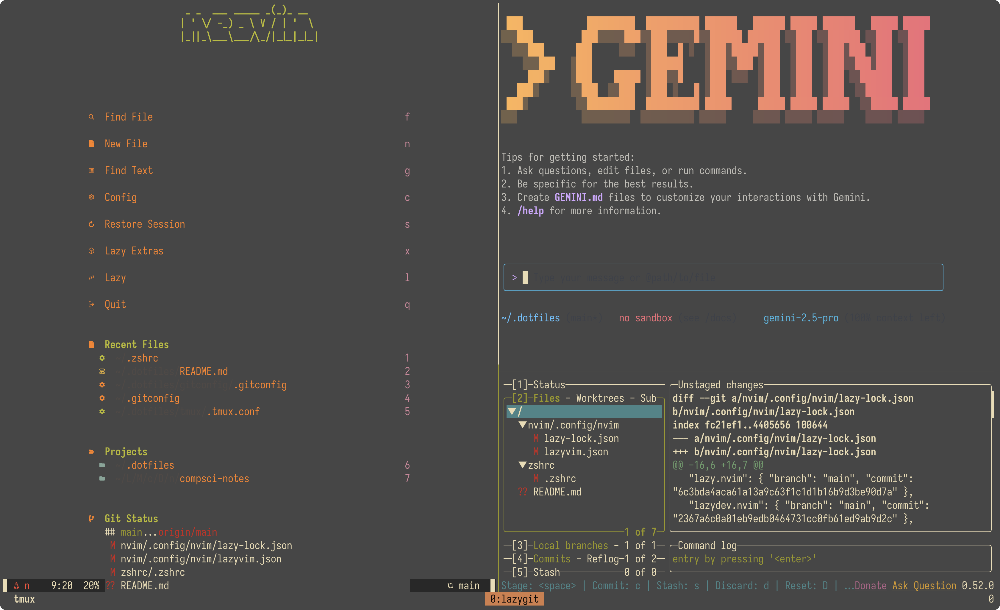

# Dotfiles

My personal dotfiles for various tools and configurations.

> [!NOTE]
> While this setup is primarily tailored for macOS, most configurations can be adapted for other operating systems by following the official installation guides for each tool.



## Prerequisites

This setup assumes you have the following software installed. However, you are free to pick and choose which tools you want to install and configure. For example, if you don't use the Sioyek PDF reader, you can simply skip its installation and the `stow sioyek` command.

Some CLI tools may be required by other configurations to work correctly (e.g., `fzf`, `ripgrep` for Neovim).

### Applications

* [Ghostty](https://github.com/ghostty/ghostty)
* [Git](https://git-scm.com/)
* [Karabiner-Elements](https://karabiner-elements.pqrs.org/)
* [Neovim](https://neovim.io/)
* [Zsh](https://www.zsh.org/)
* [Sioyek](https://sioyek.info/)
* [Tmux](https://github.com/tmux/tmux/wiki)

### Fonts

* **[Iosevka Nerd Font](https://www.nerdfonts.com/font-downloads)**: A custom build of the Iosevka font with added Nerd Font glyphs and icons. It is highly recommended for the terminal and editor to display all icons and symbols correctly.

### CLI Tools

This setup assumes you have [Homebrew](https://brew.sh/) installed for package management on macOS. The following tools are required:

* **[GNU Stow](https://www.gnu.org/software/stow/)**: For managing dotfiles.
* **[Powerlevel10k](https://github.com/romkatv/powerlevel10k)**: The Zsh theme.
* **[zsh-syntax-highlighting](https://github.com/zsh-users/zsh-syntax-highlighting)**: Fish-like syntax highlighting for Zsh.
* **[zsh-autosuggestions](https://github.com/zsh-users/zsh-autosuggestions)**: Fish-like autosuggestions for Zsh.
* **[Lazygit](https://github.com/jesseduffield/lazygit)**: A simple terminal UI for git commands.
* **[eza](https://github.com/eza-community/eza)**: A modern replacement for `ls`.
* **[zoxide](https://github.com/ajeetdsouza/zoxide)**: A smarter `cd` command.
* **[bat](https://github.com/sharkdp/bat)**: A `cat` clone with wings.
* **[fzf](https://github.com/junegunn/fzf)**: A command-line fuzzy finder.
* **[ripgrep](https://github.com/BurntSushi/ripgrep)**: A line-oriented search tool.
* **[fd](https://github.com/sharkdp/fd)**: A simple, fast and user-friendly alternative to `find`.
* **[fish](https://fishshell.com/)**: The friendly interactive shell.
* **[ast-grep](https://ast-grep.github.io/)**: A CLI tool for code structural search, lint and rewriting.
* **[LuaRocks](https://luarocks.org/)**: The package manager for Lua modules.
* **[wget](https://www.gnu.org/software/wget/)**: A free software package for retrieving files using HTTP, HTTPS, FTP and FTPS.
* **[Typst](https://typst.app/)**: A new markup-based typesetting system that is powerful and easy to learn.
* **[Node.js](https://nodejs.org/)**: A JavaScript runtime built on Chrome's V8 JavaScript engine.
* **[pnpm](https://pnpm.io/)**: A fast, disk space-efficient package manager.
* **[Gemini CLI](https://github.com/google-gemini/gemini-cli)**: A CLI from Google that brings the power of Gemini models to the terminal.

You can install most of them using Homebrew. For other operating systems, please consult the official documentation for each tool.

```bash
# Install CLI tools and applications
brew install stow neovim lazygit eza zoxide bat tmux fzf ripgrep fd fish ast-grep luarocks wget typst gnupg powerlevel10k zsh-syntax-highlighting zsh-autosuggestions node

# Install fonts
brew tap homebrew/cask-fonts
brew install --cask font-iosevka-nerd-font
```

For pnpm, you can enable it using `corepack`:

```bash
corepack enable pnpm
```

After that, execute the next command:

```bash
pnpm setup
```

For Gemini CLI, you can install it using the following command:

```bash
pnpm install -g @google/gemini-cli
```

## Directory Structure

| Directory       | Description                                           |
| --------------- | ----------------------------------------------------- |
| `ghostty/`      | Configuration for the Ghostty terminal.               |
| `gitconfig/`    | Git configuration.                                    |
| `karabiner/`    | Karabiner-Elements configuration for key mappings.    |
| `nvim/`         | Neovim configuration using LazyVim.                   |
| `p10k/`         | Powerlevel10k theme configuration for Zsh.            |
| `sioyek/`       | Sioyek configuration for the PDF reader.              |
| `tmux/`         | Tmux configuration.                                   |
| `tmux-plugins/` | Tmux plugins, managed by TPM.                         |
| `zshrc/`        | Zsh configuration file.                               |

## Installation

These dotfiles are managed using [GNU Stow](https://www.gnu.org/software/stow/), a symlink farm manager. This approach keeps the dotfiles neatly organized in this repository while making them available in their required locations in the home directory by creating symbolic links.

To install a configuration, `cd` into this directory and run `stow` on a directory name. For example, to install the Neovim configuration, run:

```bash
stow nvim
```

This will symlink the contents of the `nvim` directory (in this case, `nvim/.config/nvim`) to the appropriate location in your home directory (`~/.config/nvim`).

You can install any of the configurations by running `stow` with the directory name. For example:

```bash
stow zshrc
stow tmux
```

To remove the symlinks for a package, use the `-D` flag:

```bash
stow -D nvim
```

## Git Configuration

If you plan to use the `gitconfig` included in this repository, you will need to update it with your personal information.

### User Information

Update the `name` and `email` fields in the `gitconfig/.gitconfig` file to match your Git identity.

### SSH and GPG Keys

For secure communication with Git providers and for signing your commits, you will need to generate your own SSH and GPG keys.

* **SSH Keys**: Follow the instructions on [GitHub's documentation](https://docs.github.com/en/authentication/connecting-to-github-with-ssh/generating-a-new-ssh-key-and-adding-it-to-the-ssh-agent) to generate a new SSH key and add it to the ssh-agent.
* **GPG Keys**: Follow the instructions on [GitHub's documentation](https://docs.github.com/en/authentication/managing-commit-signature-verification/generating-a-new-gpg-key) to generate a new GPG key.

You can use the following commands as a quick reference:

* **GPG Key**: `gpg --full-generate-key`
* **SSH Key**: `ssh-keygen -t ed25519 -C "your_email@example.com"`

> [!NOTE]
> If you are not familiar with these commands, it is highly recommended to consult the official documentation linked above for detailed instructions.

Once you have generated your keys, you will need to update the `signingkey` field in the `gitconfig/.gitconfig` file with your GPG key ID.

